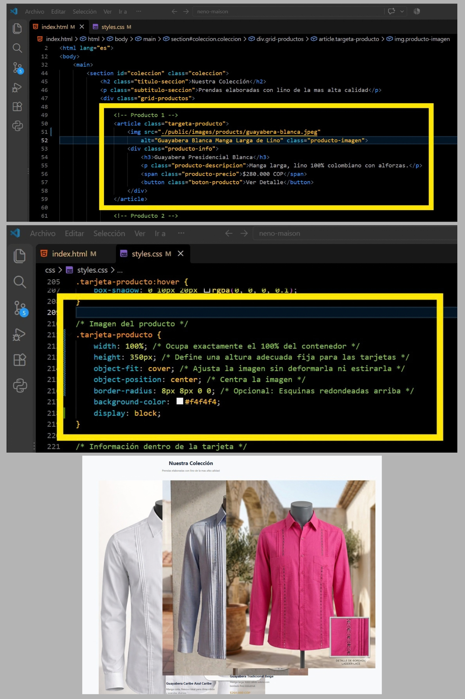
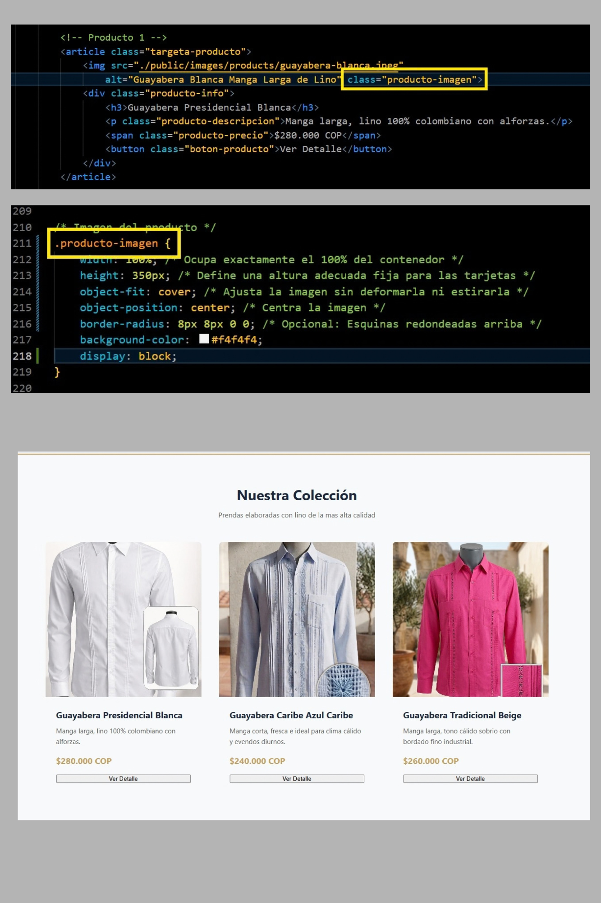

# 👔 Neno Maison — E-commerce & Identidad Web

Bienvenidos al repositorio oficial de **Neno Maison**. Este proyecto contiene la estructura web, assets de marca y maquetación de la plataforma e-commerce para nuestra línea exclusiva de camisas en lino 100%.

---

## 📂 Arquitectura del Proyecto

Estructura profesional de carpetas estandarizada mediante convención *kebab-case*:

- **assets/**: Recursos de marca, branding y publicidad.
- **public/**: Favicons e imágenes de catálogo servidas en la web.
- **css/**: Hojas de estilo.
- **js/**: Scripts e interactividad JavaScript.
- **docs/**: Documentación del proyecto y evidencias de desarrollo/testing.

---

## 📸 Proceso de Desarrollo y Evidencias

### Configuración Inicial del Entorno de Trabajo
Se utilizó Windows PowerShell y Visual Studio Code para la inicialización y estructuración del repositorio.

### 🐛 Resolución de Incidente: Especificidad CSS y Desbordamiento (Layout Overflow)

Durante la maquetación de la sección del catálogo se presentó un desbordamiento visual provocado por una falla de especificidad en el selector CSS y el tamaño nativo de las imágenes.

#### 📊 Evidencia Técnica: Antes (Error) vs. Después (Solución)

| ❌ Estado Inicial (Conflicto de Selector) | ✅ Estado Corregido (Normalización CSS) |
| :---: | :---: |
|  |  |

#### 📝 Diagnóstico Técnico
1. **Causa Raíz:** En la regla CSS se usó el selector de la caja contenedora (`.tarjeta-producto`) en lugar de apuntar a la etiqueta/clase de la imagen (`.producto-imagen`). Esto provocó que los estilos de contención (`height`, `object-fit`) no se aplicaran al elemento ``, desbordando las tarjetas.
2. **Solución:** Se ajustó la especificidad en CSS vinculando correctamente el selector `.producto-imagen`. Se mantuvo `object-fit: cover` para recortar y ajustar la imagen proporcionalmente y `background-color: #f4f4f4` como *fallback visual*.