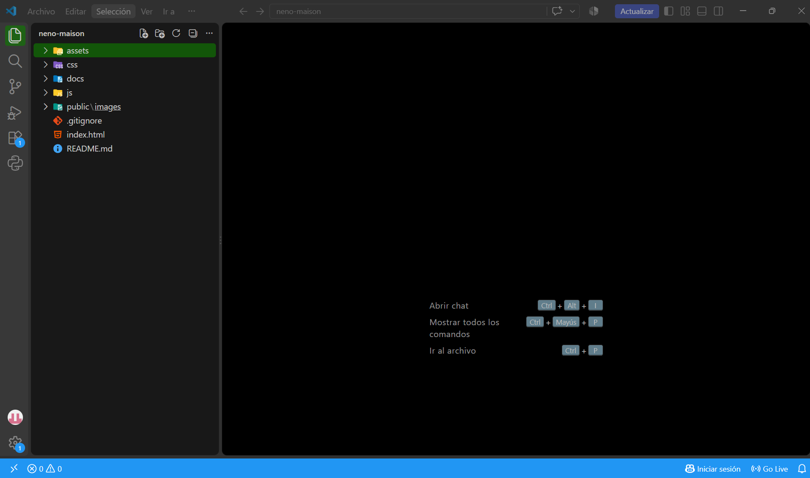

# 👔 Neno Maison — E-commerce & Identidad Web

Bienvenidos al repositorio oficial de **Neno Maison**. Este proyecto contiene la estructura web, assets de marca y maquetación de la plataforma e-commerce para nuestra línea exclusiva de camisas en lino 100%.

---

## 📂 Arquitectura del Proyecto

Estructura profesional de carpetas estandarizada mediante convención *kebab-case*:

- **assets/**: Recursos de marca, branding y publicidad.
- **public/**: Favicons e imágenes de catálogo servidas en la web.
- **css/**: Hojas de estilo.
- **js/**: Scripts e interactividad JavaScript.
- **docs/**: Documentación del proyecto y evidencias de desarrollo/testing.

---

## 📸 Proceso de Desarrollo y Evidencias

### Configuración Inicial del Entorno de Trabajo
Se utilizó Windows PowerShell y Visual Studio Code para la inicialización y estructuración del repositorio.

